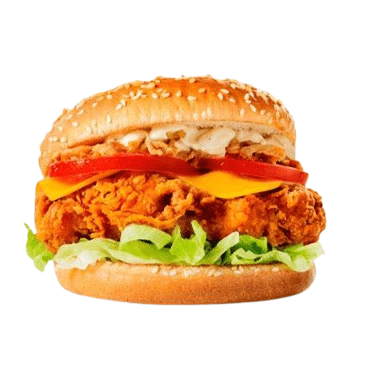
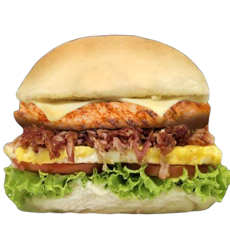
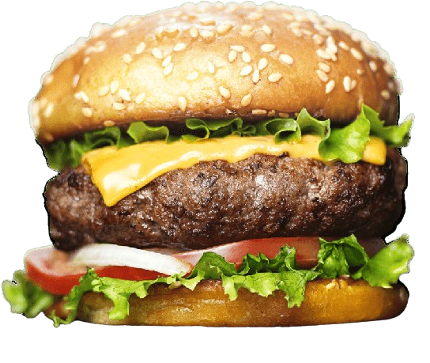
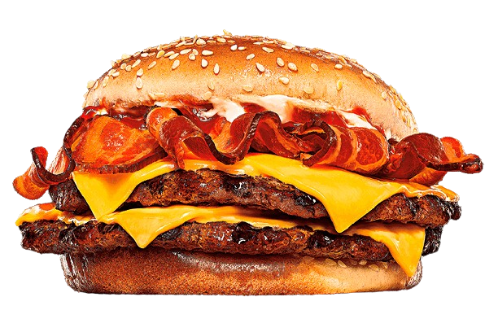
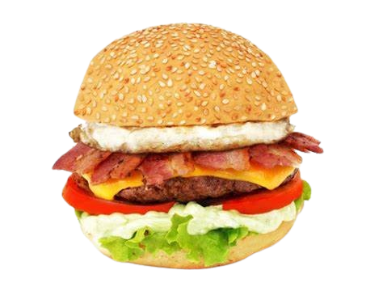
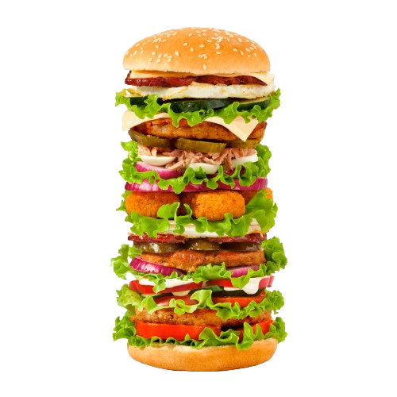

# **Sima's Burguers**
 
## ``Descrição``
Este é um guia rápido para entender o código CSS e HTML utilizado na criação da página SIMA's Burguer's.
 
## ``Índice``
 
* [Estrutura do HTML](#estrutura-do-html)
* [Style CSS](#style-css)
 
## ``Estrutura do HTML``
 
```html
 
<!-- Código HTML -->
 ```
 
<!DOCTYPE html>
<html>

<head>
    <meta charset='utf-8'>
    <meta http-equiv='X-UA-Compatible' content='IE=edge'>
    <title>Page Title</title>
    <meta name='viewport' content='width=device-width, initial-scale=1'>
    <link rel='stylesheet' type='text/css' media='screen' href='style.css'>
    <script src='main.js'></script>
</head>

<body>

    <header>
        <h1 id="sima1"> SIMA's burguer's </h1>
    </header>

    <h2>chicken</h2>

<div class="menu-item" id="div1">
    <div class="item-details">
            <h3>X-CK egg</h3>
            <p>Delicioso lanche de chicken grelhado, ovo, alface, tomate, queijo e molho da casa.</p>
            <p id="preço1">R$ 28,99</p>
    </div>
</div>


<div class="menu-item" id="div2">
    <div class="item-details">
            <h3>X-CK Frito</h3>
            <p>Delicioso lanche de chicken frito, alface, tomate, queijo cheddar, catuppiry cremoso e molho da casa.</p>
            <p id="preço1">$ 24,99</p>
    </div>
</div>



<div class="menu-item" id="div3">
    <div class="item-details">
            <h3>  X-CK Bacon Egg</h3>
            <p>  Delicioso lanche de chicken grelhado, bacon, ovo, alface, tomate, queijo e molho da casa.</p>
            <p id="preço1">$ 30,99</p>
    </div>
</div>


    <h2 id="Porções"> burguer </h2>

<div class="menu-item" id="div4">
        <div class="item-details">
            <h3>X-burguer duplo simples</h3>
            <p>Delicioso lanche de hamburguer DUPLO, queijo Duplo  e molho da casa.</p>
            <p id="preço1">$ 22,99</p>
        </div>
</div>


<div class="menu-item" id="div5">
        <div class="item-details">
            <h3>X-Burguer duplo especial </h3>
            <p>Delicioso lanche de hamburguer DUPLO, com queijo DUPLO, cebola roxa, alface, tomate, picles e molho da casa.</p>
            <p id="preço1">$ 30,99</p>
        </div>
</div>


<div class="menu-item" id="div6">
        <div class="item-details">
            <h3>X-MEGA burguer recheado </h3>
            <p>Delicioso lanche de Hamburguer MEGA, recheado com queijo, alface, tomate, mais queijo e molho da casa.</p>
            <p id="preço1">$ 32,99</p>
        </div>
</div>
 


<div class="menu-item" id="div7">
        <div class="item-details">
            <h3>X-burguer bacon</h3>
            <p>Delicioso lanche de hamburguer com bacon em tiras, alface, queijo e molho especial.</p>
            <p id="preço1">$ 22,99</p>
        </div>
</div>

    


<div class="menu-item" id="div8">
        <div class="item-details">
            <h3>X-burguer duplo bacon </h3>
            <p>Delicioso lanche de Hamburguer MEGA, recheado com queijo, alface, tomate, mais queijo e molho da casa.</p>
            <p id="preço1">$ 32,99</p>
        </div>
</div>



<div class="menu-item" id="div9">
        <div class="item-details">
            <h3>X-Burguer egg bacon </h3>
            <p>Delicioso lanche de Hamburguer com ovo, bacon em tiras, alface, tomate, queijo e molho da casa.</p>
            </div>
            <p id="preço1">$ 32,99</p>
        </div>
 </div>



 <div class="menu-item" id="div10">
        <div class="item-details">
            <h3>X-É DIFÌCIO</h3>
            <p>MUITA SALADA, MUITO FRANGO, MUITO OVO e MUITO GOSTOSO.</p>
            <p id="preço2">$ 69,99</p>
            <p id="desafio"> QUEM CONSEGUIR COMER ESSE LANCHE <br> EM 15 MINUTOS, NÃO PAGA!!!!!!</p>
        </div>
 </div>
 


</body>

</html>
```
 
 
## ``Style CSS``
```html
 
<!-- Código CSS -->
 
header {
    background-color: rgb(255, 0, 0);
    padding-top: 50px;
    padding-bottom: 35px;
    position: relative;
    top: 60px;

}

body {
    background-color: rgb(255, 255, 255);
    margin: 0px;
}

nav#menu ul {
    text-transform: uppercase;
    list-style: none;
    position: absolute;
    top: 10px;
    left: 850px;
}

nav#menu {
    display: block;
}

nav#menu li {
    display: inline-block;
    background-color: rgb(255, 255, 255);
    padding: 10px;
    border-radius: 20px;
    font-family: Arial, Helvetica, sans-serif;


}

h1#sima1 {
    font-family: Impact, Haettenschweiler, 'Arial Narrow Bold', sans-serif;
    font-size: 100px;
    position: absolute;
    top: -80px;
    left: 340px;
    color: rgb(255, 255, 255);
}


h2 {
    position: absolute;
    top: 200px;
    left: 565px;
    font-family: Impact, Haettenschweiler, 'Arial Narrow Bold', sans-serif;
    color: rgb(255, 255, 255);
    font-size: 50px;
    background-color: rgb(255, 135, 50);
    padding: 5px;
    border-radius: 20px;
}

h2#Porções {
    position: absolute;
    top: 675px;
    left: 565px;
    font-family: Impact, Haettenschweiler, 'Arial Narrow Bold', sans-serif;
    color: rgb(255, 255, 255);
    font-size: 50px;
    background-color: rgb(255, 135, 50);
    padding: 5px;
    border-radius: 20px;
}

.menu-item {
    overflow: hidden;
    margin-bottom: 20px;
    box-shadow: 0 4px 8px rgba(0, 0, 0, 0.1);
    border-radius: 15px;
}

.menu-item a {
    display: flex;
    text-decoration: none;
    color: inherit;
}

.menu-item img {
    max-width: 100%;
    border-radius: 15px 15px 0 0;
}

.item-details {
    flex: 1;
    padding: 20px;
    text-align: left;
}


.item-info {
    display: flex;
    align-items: center;
    margin-bottom: 10px;
}

.menu-item:hover {
    transform: scale(1.05);
    box-shadow: 0 8px 16px rgba(0, 0, 0, 0.2);
}


div.menu-item#div1 {
    position: absolute;
    top: 350px;
    width: 30%;
    height: 50%;
    left: 40px;
    background-color: rgb(255, 135, 50);
    font-family: Arial, Helvetica, sans-serif;
}

div.menu-item#div2 {
    position: absolute;
    top: 350px;
    width: 30%;
    height: 50%;
    left: 460px;
    background-color: rgb(255, 135, 50);
    font-family: Arial, Helvetica, sans-serif;
}

div.menu-item#div3 {
    position: absolute;
    top: 350px;
    width: 30%;
    height: 50%;
    left: 880px;
    background-color: rgb(255, 135, 50);
    font-family: Arial, Helvetica, sans-serif;
}

div.menu-item#div4 {
    position: absolute;
    top: 835px;
    width: 30%;
    height: 50%;
    left: 40px;
    background-color: rgb(255, 135, 50);
    font-family: Arial, Helvetica, sans-serif;
}

div.menu-item#div5 {
    position: absolute;
    top: 835px;
    width: 30%;
    height: 50%;
    left: 460px;
    background-color: rgb(255, 135, 50);
    font-family: Arial, Helvetica, sans-serif;
}

div.menu-item#div6 {
    position: absolute;
    top: 835px;
    width: 30%;
    height: 50%;
    left: 880px;
    background-color: rgb(255, 135, 50);
    font-family: Arial, Helvetica, sans-serif;
}

div.menu-item#div6 {
    position: absolute;
    top: 835px;
    width: 30%;
    height: 50%;
    left: 880px;
    background-color: rgb(255, 135, 50);
    font-family: Arial, Helvetica, sans-serif;
}

div.menu-item#div7 {
    position: absolute;
    top: 1190px;
    width: 30%;
    height: 50%;
    left: 40px;
    background-color: rgb(255, 135, 50);
    font-family: Arial, Helvetica, sans-serif;
}

div.menu-item#div8 {
    position: absolute;
    top: 1190px;
    width: 30%;
    height: 50%;
    left: 460px;
    background-color: rgb(255, 135, 50);
    font-family: Arial, Helvetica, sans-serif;
}

div.menu-item#div9 {
    position: absolute;
    top: 1190px;
    width: 30%;
    height: 50%;
    left: 880px;
    background-color: rgb(255, 135, 50);
    font-family: Arial, Helvetica, sans-serif;
}

div.menu-item#div10 {
    position: absolute;
    top: 1545px;
    width: 35%;
    height: 85%;
    left: 425px;
    background-color: rgb(255, 135, 50);
    font-family: Arial, Helvetica, sans-serif;
}


img#img1 {
    position: absolute;
    top: 510px;
    left: 125px;
}

img#img2 {
    position: absolute;
    top: 480px;
    left: 555px;
}

img#img3 {
    position: absolute;
    top: 490px;
    left: 985px;
}

img#img4 {
    position: absolute;
    top: 965px;
    left: 121px;
}

img#img5 {
    position: absolute;
    top: 980px;
    left: 570px;
}

img#img6 {
    position: absolute;
    top: 995px;
    left: 982px;
}
img#img7 {
    position: absolute;
    top: 955px;
    left: 121px;
}
img#img8 {
    position: absolute;
    top: 1335px;
    left: 140px;
}
img#img9 {
    position: absolute;
    top: 1340px;
    left: 550px;
}
img#img10 {
    position: absolute;
    top: 1340px;
    left: 970px;
}
img#img11 {
    position: absolute;
    top: 1680px;
    left: 485px;
}

p#preço1 {
    position: absolute;
    left: 300px;
    top: 250px;
    font-size: large;
    color: #efff94;
}
p#preço2 {
    position: absolute;
    left:350px;
    top: 400px;
    font-size: large;
    color: #efff94;
}
p#desafio {
    position: absolute;
    left: 50px;
    top: 460px;
    font-size: large;
    color: #e5ff00;
}
p{color: rgb(255, 255, 255);}
h3{color:  rgb(255, 255, 255);}
```

## ``Estrutura HTML(index.html)``
O arquivo HTML contém uma estrutura básica com uma seção de cabeçalho e várias seções de itens do menu.
Cada item do menu é um bloco com uma imagem e detalhes do item.
A seção final apresenta um item de menu especial chamado "X-É DIFÌCIO" com uma mensagem de desafio.
Observação: Certifique-se de que as imagens referenciadas no código HTML (src atributos) estejam disponíveis no diretório correto.

Espero que este guia ajude a compreender a estrutura e o estilo da página SIMA's Burguer's. Se houver alguma dúvida, sinta-se à vontade para perguntar!

## ``Detalhes do estilo (style.css)``
**Cabeçalho:**
A cor de fundo do cabeçalho é vermelha (rgb(255, 0, 0)).
Há um espaçamento interno de 50px na parte superior e 35px na parte inferior.
O cabeçalho é posicionado relativamente com um deslocamento de 60px para baixo.

# **Corpo (Body):**
O fundo do corpo é branco (rgb(255, 255, 255)).
A margem do corpo é zero.

# **Menu:**
A lista do menu é estilizada como maiúscula e é posicionada absolutamente a 10px do topo e 850px da esquerda.
Os itens de menu são exibidos em linha, com fundo branco, padding de 10px, borda arredondada e uma fonte específica.

# **Títulos (h1, h2, h3):**
h1 com o ID "sima1" é estilizado com uma fonte específica, tamanho grande, posição absoluta e cor branca.
h2 e h3 têm estilos específicos com diferentes posições e cores.

# **Itens do Menu:**
Cada item do menu é um bloco com sombra, borda arredondada e um efeito de escala e sombra ao passar o mouse.

# **Posicionamento dos Itens do Menu:**
Os itens do menu são posicionados absolutamente na página com diferentes coordenadas (top, left).

# **Imagens:**
As imagens dos itens do menu são estilizadas para ter uma largura máxima de 100% e bordas arredondadas.

# **Preços e Desafio:**
Os preços e a mensagem de desafio têm posições absolutas e tamanhos específicos.
 ```